<!--
	·		 ·	 |	·	 ·		|		·	 ·
	 ·	 |		·		·	|	 ·		|	·
		你好,看源码的人。
		这一页没有用任何现成组件:每张图都是手写的动画 SVG,
		由 profile/render.py 从 profile/live.json 冲洗出来,
		GitHub Actions 每 6 小时自动显影一次。
		拆解见 docs/技术手册.md。
	·		|	 ·		·	 |	·		 |		·
		 ·		·	 |		·		·	 |	 ·	·
-->

<a href="https://cinexul.com"><picture><source media="(prefers-color-scheme: light)" srcset="assets/nav-site-light.svg"></picture></a><a href="https://cinexul.com/photography"><picture><source media="(prefers-color-scheme: light)" srcset="assets/nav-photo-light.svg"></picture></a><a href="https://cinexul.com/essays"><picture><source media="(prefers-color-scheme: light)" srcset="assets/nav-essays-light.svg"></picture></a><a href="https://cinexul.com/news"><picture><source media="(prefers-color-scheme: light)" srcset="assets/nav-news-light.svg"></picture></a><a href="https://cinexul.com/feed.xml"><picture><source media="(prefers-color-scheme: light)" srcset="assets/nav-feed-light.svg"></picture></a><a href="docs/技术手册.md"><picture><source media="(prefers-color-scheme: light)" srcset="assets/nav-how-light.svg"></picture></a>

<picture><source media="(prefers-color-scheme: light)" srcset="assets/h1-light.svg"></picture>

<picture><source media="(prefers-color-scheme: light)" srcset="assets/h2-light.svg"></picture>

<picture><source media="(prefers-color-scheme: light)" srcset="assets/h3-light.svg"></picture>

雨夜 · 车窗 · 暗室 —— 本页由手写 SVG 构成,零框架零依赖,<a href="docs/技术手册.md">拆解在此</a>。

&nbsp;⚙︎ 这一页是怎么做出来的(点开)

 

GitHub 的 README 会剥掉一切 CSS / JS,但 `` 里的 SVG 是一份独立文档——
内部的 CSS 动画、滤镜、渐变、蒙版全部生效。于是:

- **整页 = 若干张手写动画 SVG**,由 [`profile/render.py`](profile/render.py) 从数据渲染而来,伪随机数定种子,渲染结果字节级可复现;
- **雨、水珠、散景、打字、拨弦、胶片传送、CRT 打字、隧道推进**全部是 SVG 内部的 CSS 动画(为兼容性刻意不用 SMIL);胶片颗粒是渲染器手工编码的 PNG 噪点贴图;
- **数据是活的**:[`profile/fetch.py`](profile/fetch.py) 在 [GitHub Actions](.github/workflows/develop.yml) 里每 6 小时抓一次公开数据(语言字节、star、近期 push、博客 RSS),重渲染并自动提交——提交历史就是显影批号;
- **明暗主题**:分节标题与导航按钮用 `<picture>` + `prefers-color-scheme` 切换深浅两版;
- **尊重访客**:所有 SVG 内置 `prefers-reduced-motion` 守卫,系统开了减弱动态就静止。

完整拆解(以及"README 到底能玩到多复杂"的答案):[docs/技术手册.md](docs/技术手册.md)

