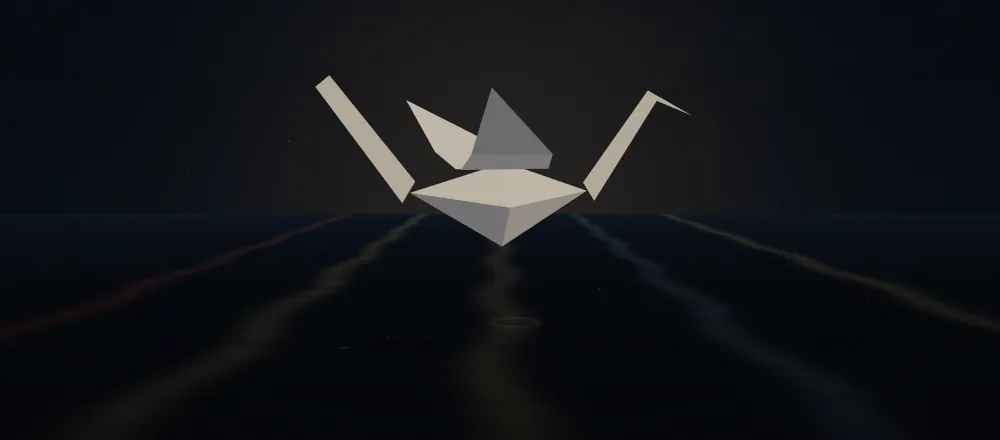
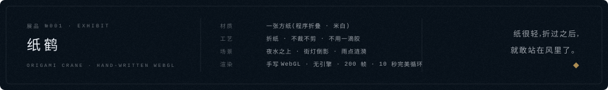
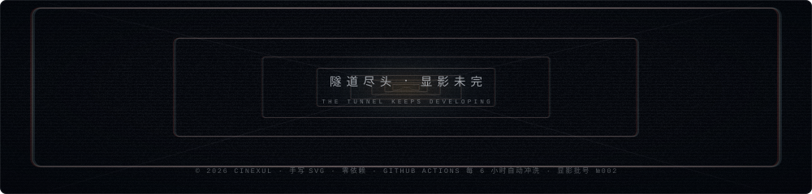

<!--
	·		 ·	 |	·	 ·		|		·	 ·
	 ·	 |		·		·	|	 ·		|	·
		你好,看源码的人。
		这一页没有用任何现成组件:每张图都是手写的动画 SVG,
		3D 展品是手写 WebGL 逐帧录制的动画 WebP,
		由 profile/ 下的渲染器冲洗而来,Actions 每 6 小时自动显影。
		拆解见 docs/技术手册.md。
	·		|	 ·		·	 |	·		 |		·
		 ·		·	 |		·		·	 |	 ·	·
-->

<picture><source media="(prefers-color-scheme: light)" srcset="assets/h1-light.svg"></picture>

<picture><source media="(prefers-color-scheme: light)" srcset="assets/h2-light.svg"></picture>

<picture><source media="(prefers-color-scheme: light)" srcset="assets/h3-light.svg"></picture>

<a href="https://cinexul.com">cinexul.com</a>&nbsp;·&nbsp;<a href="https://cinexul.com/feed.xml">rss</a>&nbsp;·&nbsp;<a href="docs/技术手册.md">这一页的拆解</a>

&nbsp;⚙︎ 这一页是怎么做出来的(点开)

 

GitHub 的 README 会剥掉一切 CSS / JS,但 `` 里的 SVG 是一份独立文档——
内部的 CSS 动画、滤镜、渐变、蒙版全部生效。于是:

- **雨夜车窗、弦、终端、隧道**都是手写的动画 SVG,由 [`profile/render.py`](profile/render.py) 从数据渲染,伪随机定种子、字节级可复现;水珠按"透镜"画:暗芯、薄亮边、底部映街灯,蠕动式滑落并留下湿痕;
- **纸鹤**是手写 WebGL([`profile/exhibit/scene.html`](profile/exhibit/scene.html),无引擎):折痕即三角面、纸面两面受光并微微透光,夜水、街灯倒影、涟漪与倒影晃动都在着色器里;无头浏览器逐帧录制 200 帧,Pillow 合成 10 秒完美循环的动画 WebP;
- **数据是活的**:[`profile/fetch.py`](profile/fetch.py) 在 [Actions](.github/workflows/develop.yml) 里每 6 小时抓一次公开数据(语言字节、star、近期 push),重渲染并自动提交——提交历史就是显影批号;
- 分节标题用 `<picture>` + `prefers-color-scheme` 跟随明暗主题;所有 SVG 内置 `prefers-reduced-motion` 守卫。

完整拆解(以及"README 到底能玩到多复杂"的答案):[docs/技术手册.md](docs/技术手册.md)

